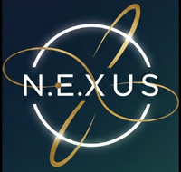

<p align="center">
  
</p>

<h1 align="center">N.E.X.U.S. OneApp</h1>

<p align="center">
  <strong>Das Cockpit der Souveränität – eine dezentrale Alpha für die Menschheitsfamilie</strong><br>
  <strong>The cockpit of sovereignty – a decentralized alpha for the human family</strong>
</p>

<p align="center">
  
  
  
  
</p>

<p align="center">
  <a href="https://github.com/nexus-united-species/oneapp/releases">Download</a> ·
  <a href="https://www.nexus-terminal.org/oneapp.html">Webseite / Website</a> ·
  <a href="https://community.nexus-terminal.org/">Community</a> ·
  <a href="https://github.com/nexus-united-species/oneapp/discussions">Diskussionen / Discussions</a>
</p>

<p align="center">
  <a href="#-deutsch">🇩🇪 Deutsch</a> &nbsp;|&nbsp; <a href="#-english">🇬🇧 English</a>
</p>

---

## 🇩🇪 Deutsch

> **Alpha-Hinweis:** Die App befindet sich in aktiver Entwicklung. Sie ist für Tests mit informierten Pionieren gedacht und noch nicht für schutzbedürftige oder sicherheitskritische Kommunikation freigegeben. Bitte den [Haftungsausschluss](DISCLAIMER.md) lesen.

### Was ist die OneApp?

Die N.E.X.U.S. OneApp verbindet selbstbestimmte Identität, Kommunikation, Gemeinschaften und demokratische Entscheidungswerkzeuge in einer Flutter-App. Sie arbeitet offline-first und nutzt je nach Situation Nostr, das lokale Netzwerk (LAN) und Bluetooth (BLE) als Transportwege. Der Quellcode steht unter AGPL v3.

Das langfristige Ziel ist eine dezentrale Infrastruktur ohne Abhängigkeit von einer einzelnen Plattform. Die heutige Alpha erreicht dieses Ziel noch nicht vollständig: Für Kommunikation über das Internet werden öffentliche Nostr-Relays genutzt, und es existieren administrative Rollen.

### Aktueller Funktionsstand (v0.2.0-alpha)

| Bereich | Stand |
|---|---|
| Identität | BIP-39-Seed, deterministische Schlüssel und DID, Pseudonym |
| Chat | Direktnachrichten, Kanäle, Text, Bilder, Audio, Antworten, Suche, Reaktionen |
| Transport | Nostr, lokales Netzwerk und BLE |
| Kontakte | vier Vertrauensstufen, QR-Verifizierung und Selective Disclosure |
| Zellen | lokale und thematische Gemeinschaften, Beitritts- und Mitgliederverwaltung |
| Dorfplatz | Posts, Reposts, Kommentare, Umfragen, Reaktionen und Löschpfade |
| Governance | Anträge, Diskussion, drei Abstimmungsmodi, Auszählung, Decision Records und Stichwahlen |
| Liquid Democracy | antragsbezogene, nicht-transitive Delegation mit Widerruf und automatischem Widerruf |
| Backup/Updates | lokale Backup-Funktionen und Update-Prüfung |

Quadratic Voting, AETHER, interzelluläre Governance und die Superadmin-Abwahl sind noch nicht fertig implementiert.

### Sicherheits- und Datenschutzstand

- Direktnachrichten über den aktuellen Nostr-Pfad verwenden NIP-04. NIP-44 ist noch nicht implementiert.
- Governance-Events wie Anträge, Stimmen, Ergebnisse und Delegationen werden derzeit als Klartext über öffentliche Relays verteilt. Sie sind nicht als private Kommunikation zu behandeln.
- Die App besitzt lokale Hash- und Signaturmechanismen. Eingehende Nostr-Events werden im heutigen Produktivpfad jedoch noch nicht durchgängig kryptografisch verifiziert und gegen Absenderberechtigungen geprüft.
- Backups sichern ausgewählte Identitäts-, Kontakt-, Kanal-, Zell- und Einstellungsdaten, nicht automatisch den vollständigen Nachrichtenverlauf.

Die bestätigten Risiken und die Reihenfolge der Härtung stehen im [Projektstatus](docs/current/PROJECT_STATUS.md) und in der [Release-Checkliste](docs/current/RELEASE_READINESS.md). Sicherheitslücken bitte **nicht öffentlich** melden, sondern wie in der [Sicherheitsrichtlinie](https://github.com/nexus-united-species/.github/blob/main/SECURITY.md) beschrieben.

### Installation

**Android**

1. `NexusOneApp_v0.2.0.apk` aus dem [aktuellen Release](https://github.com/nexus-united-species/oneapp/releases) laden.
2. Die APK installieren; Android muss die Installation aus der gewählten Quelle erlauben.
3. Die Seed-Phrase beim ersten Start offline auf Papier sichern.

**Windows**

1. `Setup_NexusOneApp_v0.2.0.exe` aus dem [aktuellen Release](https://github.com/nexus-united-species/oneapp/releases) laden.
2. Den Installer ausführen und anschließend die Alpha-Hinweise beachten.

Die Bedienungsanleitung liegt als [Markdown](docs/guides/Bedienungsanleitung.md) im Repository und als PDF im [Release](https://github.com/nexus-united-species/oneapp/releases) vor.

Ältere Versionen bis v0.1.11 liegen zusätzlich im [Archiv des Repositories `terminal`](https://github.com/nexus-united-species/terminal/releases).

### Entwicklung

| Ebene | Technologie |
|---|---|
| Oberfläche | Flutter / Dart |
| Daten | SQLite (`sqflite` / `sqflite_ffi`) |
| State/Navigation | Provider / GoRouter |
| Identität | BIP-39, Ed25519/SLIP-0010, `did:key` |
| Transport | Nostr, BLE, LAN |
| Kryptografie | projektspezifische AES-GCM- und X25519-Pfade sowie NIP-04 im Nostr-DM-Pfad |

```bash
git clone https://github.com/nexus-united-species/oneapp.git
cd oneapp
flutter pub get
flutter run              # Android-Gerät oder Emulator
flutter run -d windows   # Windows
```

Vor jedem Pull Request:

```bash
flutter analyze
flutter test
```

> **Wichtig:** Nicht mit `flutter clean`, `adb uninstall` oder `flutter install` auf bestehenden Alpha-Installationen arbeiten – das kann lokale Daten und die Identität löschen. Details und die aktuelle Testbasis stehen in der [Testanleitung](docs/guides/testing/TESTING.md).

```text
lib/
├── core/        Identität, Kryptografie, Transport, Storage, Router
├── features/    Oberfläche und Fachlogik nach Funktionsbereich
│   ├── chat/
│   ├── cells/
│   ├── dorfplatz/
│   ├── governance/
│   └── ...
└── services/    bereichsübergreifende Dienste
```

Der Einstieg in alle aktuellen Dokumente ist [docs/INDEX.md](docs/INDEX.md). Architektur- und Arbeitsregeln (auch für KI-gestützte Entwicklung) stehen in [CLAUDE.md](CLAUDE.md).

### Nächster Entwicklungsblock

Vor neuen Großfunktionen wird die v0.2.0-Alpha gehärtet:

1. Nostr-`e`-Tags für Reaktionen und Löschungen korrigieren.
2. Stimmberechtigten-Snapshot beim Abstimmungsstart einfrieren.
3. Vollständigen Decision-Record-Retry sicherstellen.
4. Cross-Device-Tests und bekannte UI-Testfehler bereinigen.
5. Empfangsverifikation und Senderautorisierung planen und umsetzen.

Danach kann Quadratic Voting gemäß [G2 v1.5](docs/specs/governance/G2_Spezifikation_v1.5.md) neu priorisiert werden. AETHER bleibt bis zu einer bewussten Freigabe ein Entwurf.

### Mitmachen

Fehler und Verbesserungsvorschläge sind als [Issue](https://github.com/nexus-united-species/oneapp/issues) willkommen, Fragen und Ideen in den [Diskussionen](https://github.com/nexus-united-species/oneapp/discussions). Beiträge sollten klein, nachvollziehbar und mit Tests versehen sein – siehe den [Leitfaden für Beiträge](https://github.com/nexus-united-species/.github/blob/main/CONTRIBUTING.md) und den [Verhaltenskodex](https://github.com/nexus-united-species/.github/blob/main/CODE_OF_CONDUCT.md). Zusätzlich gelten die Datenverlust- und Sync-Regeln aus [CLAUDE.md](CLAUDE.md).

### Rechtliches

- [Lizenz](LICENSE): AGPL v3
- [Haftungsausschluss](DISCLAIMER.md)
- [Projektwebseite](https://www.nexus-terminal.org)

<p align="right"><a href="#-english">English ↓</a></p>

---

## 🇬🇧 English

> **Alpha notice:** The app is under active development. It is intended for testing by informed pioneers and is not yet approved for sensitive or security-critical communication. Please read the [disclaimer](DISCLAIMER.md) (German).

### What is the OneApp?

The N.E.X.U.S. OneApp combines self-sovereign identity, communication, communities and democratic decision-making tools in one Flutter app. It works offline-first and, depending on the situation, uses Nostr, the local network (LAN) and Bluetooth (BLE) as transports. The source code is licensed under AGPL v3.

The long-term goal is a decentralized infrastructure that does not depend on any single platform. Today's alpha does not fully reach that goal yet: communication over the internet uses public Nostr relays, and administrative roles exist.

### Current features (v0.2.0-alpha)

| Area | Status |
|---|---|
| Identity | BIP-39 seed, deterministic keys and DID, pseudonym |
| Chat | Direct messages, channels, text, images, audio, replies, search, reactions |
| Transport | Nostr, local network and BLE |
| Contacts | four trust levels, QR verification and selective disclosure |
| Cells | local and thematic communities, joining and member management |
| Village square (Dorfplatz) | posts, reposts, comments, polls, reactions and deletion |
| Governance | proposals, discussion, three voting modes, tallying, decision records and runoffs |
| Liquid democracy | per-proposal, non-transitive delegation with revocation and automatic revocation |
| Backup/updates | local backup functions and update check |

Quadratic voting, AETHER, inter-cell governance and voting out the superadmin are not fully implemented yet.

### Security and privacy status

- Direct messages over the current Nostr path use NIP-04. NIP-44 is not implemented yet.
- Governance events such as proposals, votes, results and delegations are currently distributed as plain text over public relays. They must not be treated as private communication.
- The app has local hashing and signing mechanisms. However, incoming Nostr events are not yet consistently cryptographically verified and checked against sender permissions in today's production path.
- Backups save selected identity, contact, channel, cell and settings data – not automatically the full message history.

Confirmed risks and the hardening order are documented in the [project status](docs/current/PROJECT_STATUS.md) and the [release checklist](docs/current/RELEASE_READINESS.md) (German). Please do **not** report security vulnerabilities publicly – follow the [security policy](https://github.com/nexus-united-species/.github/blob/main/SECURITY.md).

### Installation

**Android**

1. Download `NexusOneApp_v0.2.0.apk` from the [latest release](https://github.com/nexus-united-species/oneapp/releases).
2. Install the APK; Android must allow installation from the chosen source.
3. On first launch, write your seed phrase down on paper and keep it offline.

**Windows**

1. Download `Setup_NexusOneApp_v0.2.0.exe` from the [latest release](https://github.com/nexus-united-species/oneapp/releases).
2. Run the installer and keep the alpha notices in mind.

The user guide is available as [Markdown](docs/guides/Bedienungsanleitung.md) in this repository and as a PDF in the [release](https://github.com/nexus-united-species/oneapp/releases) (both German for now).

Older versions up to v0.1.11 are also available in the [archive of the `terminal` repository](https://github.com/nexus-united-species/terminal/releases).

### Development

| Layer | Technology |
|---|---|
| UI | Flutter / Dart |
| Data | SQLite (`sqflite` / `sqflite_ffi`) |
| State/navigation | Provider / GoRouter |
| Identity | BIP-39, Ed25519/SLIP-0010, `did:key` |
| Transport | Nostr, BLE, LAN |
| Cryptography | project-specific AES-GCM and X25519 paths plus NIP-04 for Nostr DMs |

```bash
git clone https://github.com/nexus-united-species/oneapp.git
cd oneapp
flutter pub get
flutter run              # Android device or emulator
flutter run -d windows   # Windows
```

Before every pull request:

```bash
flutter analyze
flutter test
```

> **Important:** Do not use `flutter clean`, `adb uninstall` or `flutter install` on existing alpha installations – this can delete local data and the identity. Details and the current test baseline are in the [testing guide](docs/guides/testing/TESTING.md) (German).

```text
lib/
├── core/        identity, cryptography, transport, storage, router
├── features/    UI and domain logic per feature area
│   ├── chat/
│   ├── cells/
│   ├── dorfplatz/
│   ├── governance/
│   └── ...
└── services/    cross-cutting services
```

The entry point to all current documents is [docs/INDEX.md](docs/INDEX.md). Architecture and working rules (including for AI-assisted development) are in [CLAUDE.md](CLAUDE.md). Most project documentation is currently in German.

### Next development block

Before new major features, the v0.2.0 alpha is being hardened:

1. Fix Nostr `e` tags for reactions and deletions.
2. Freeze the snapshot of eligible voters when a vote starts.
3. Ensure a complete decision-record retry.
4. Clean up cross-device tests and known UI test failures.
5. Plan and implement receive-side verification and sender authorization.

After that, quadratic voting according to [G2 v1.5](docs/specs/governance/G2_Spezifikation_v1.5.md) can be re-prioritized. AETHER remains a draft until it is deliberately approved.

### Contributing

Bugs and suggestions are welcome as [issues](https://github.com/nexus-united-species/oneapp/issues), questions and ideas in the [Discussions](https://github.com/nexus-united-species/oneapp/discussions). Contributions should be small, traceable and come with tests – see the [contribution guide](https://github.com/nexus-united-species/.github/blob/main/CONTRIBUTING.md) and the [code of conduct](https://github.com/nexus-united-species/.github/blob/main/CODE_OF_CONDUCT.md). The data-loss and sync rules in [CLAUDE.md](CLAUDE.md) apply as well. Issues and pull requests in English or German are equally welcome.

### Legal

- [License](LICENSE): AGPL v3
- [Disclaimer](DISCLAIMER.md) (German)
- [Project website](https://nexus-terminal.org/en/)

<p align="right"><a href="#-deutsch">Deutsch ↑</a></p>

---

<p align="center"><em>Protokoll, nicht Plattform. Für alle. · Protocol, not platform. For everyone.</em></p>
